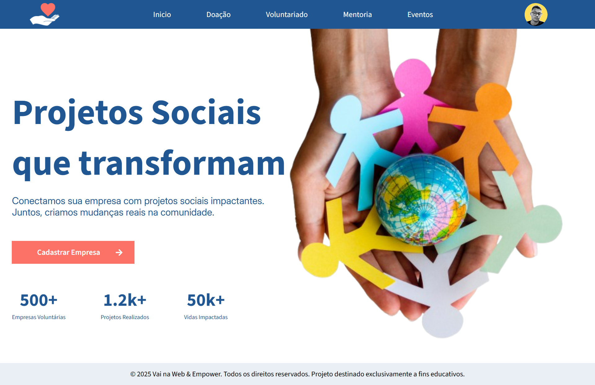
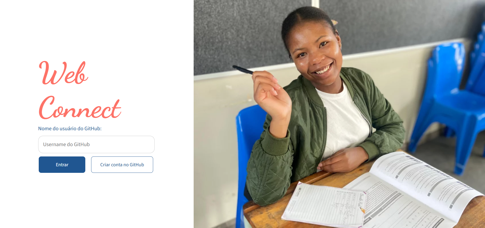

# 🌍 Plataforma de Projetos Sociais

Este projeto consiste no desenvolvimento de uma **plataforma digital fictícia** criada para conectar **projetos sociais**, **voluntários**, **mentores**, **doadores** e pessoas interessadas em gerar **impacto positivo na sociedade**.

A aplicação foi pensada para transmitir **empatia, confiança e profissionalismo**, utilizando tecnologia moderna e boas práticas de desenvolvimento frontend.

---

## 🎯 Objetivo do Projeto

A plataforma tem como principais objetivos:

- Dar visibilidade a projetos sociais
- Apresentar informações claras, acessíveis e organizadas
- Inspirar engajamento e transformação social
- Facilitar a conexão entre voluntários, organizações e apoiadores
- Utilizar o design como ferramenta para transmitir confiança e impacto social

O time de frontend foi responsável por construir essa solução com foco em **experiência do usuário**, **responsividade** e **arquitetura organizada**.

---

## 🛠️ Tecnologias Utilizadas

### ✅ Tecnologias Obrigatórias

- **React.js**
  - Projeto criado utilizando React
  - Componentização reutilizável (Header, Footer, Cards, etc.)
  - Código limpo e organizado

- **React Router DOM**
  - Gerenciamento de rotas da aplicação
  - Rotas centralizadas em um arquivo dedicado

- **SCSS (Sass)**
  - Uso de variáveis para cores, fontes e espaçamentos
  - Aninhamento de seletores
  - Estrutura modular de estilos

---

## 🧭 Rotas da Aplicação

As seguintes rotas foram implementadas:

| Rota          | Descrição                                                |
| ------------- | -------------------------------------------------------- |
| `/`           | Página inicial com apresentação da plataforma e projetos |
| `/donation`   | Página de doações                                        |
| `/volunteer`  | Página para escolha de projetos para voluntariado        |
| `/mentorship` | Página para projetos de mentoria                         |
| `/events`     | Página de eventos e palestras                            |
| `/about`      | Página de perfil do usuário                              |

## 🎨 Design

| Pagina inicial                                        | Tela de login                                       |
| ----------------------------------------------------- | --------------------------------------------------- |
|  |  |

### 🎨 Paleta de Cores

As cores foram escolhidas para transmitir:

- 💙 **Confiança e tecnologia**
- 🧡 **Impacto social e esperança**
- 🤍 **Simplicidade e acessibilidade**

### ✍️ Tipografia

- Fonte principal: **Inter** ou **Source Sans 3** (Google Fonts)
- Estilo:
  - Moderno
  - Suave
  - Fácil leitura

---

## 📱 Responsividade

A aplicação é totalmente responsiva, utilizando:

- Unidades relativas (`%`, `vh`, `vw`, `rem`)
- `max-width`
- Media queries

Compatível com:

- Desktop
- Tablets
- Smartphones
- SmartWatch

---

## ❌ Restrições

Não é permitido o uso de:

- Frameworks CSS (Bootstrap, Tailwind, etc.)
- Bibliotecas de UI prontas
- Plugins externos de layout

---

## ⭐ Diferenciais (Opcional)

Funcionalidades extras implementáveis:

- Animações suaves com CSS
- Componentes altamente reutilizáveis
- Simulação de dados de projetos sociais
- Página de projetos nos quais o usuário se voluntariou
- Página de configurações de conta

---

## 💬 Mensagem Final

> Conectar pessoas é transformar realidades.
> Projetos sociais mudam comunidades.
> Tecnologia amplia esse impacto.

Ao desenvolver esta plataforma, são praticadas habilidades essenciais do mercado moderno de frontend:

- Organização de código
- Componentização
- Roteamento
- Estilização profissional
- Responsividade

Agora é sua vez.
Construa uma plataforma que una **tecnologia e propósito**.

🤝💙🌱✨
